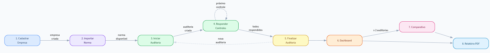
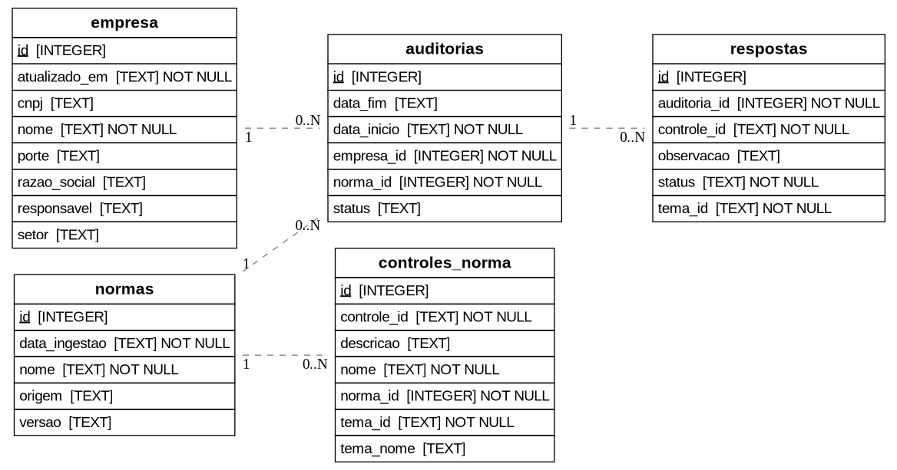

# PSI — Plataforma de Segurança da Informação

> Projeto desenvolvido como atividade da disciplina de Segurança da Informação.  
> Especificação: [PSI.md](https://github.com/mehranmisaghi/cybersecurity/blob/main/projetos/PSI.md)

---

## O que é o PSI?

O **Projeto de Segurança de Informação** é uma plataforma web para gestão e diagnóstico de conformidade com normas de segurança da informação, como **ISO/IEC 27002** e **ISO/IEC 27701**.

### Principais vantagens

- **Local-first e seguro** — toda a aplicação roda na máquina do próprio usuário. Nenhum dado é enviado a servidores externos; o banco de dados (SQLite) fica armazenado localmente.
- **Portável** — pode ser empacotado como executável standalone (sem necessidade de instalar Python) para Windows, Linux e macOS.
- **Sem dependências de nuvem** — funciona completamente offline após a instalação.

### Funcionalidades

| Módulo             | Descrição                                                         |
| ------------------ | ----------------------------------------------------------------- |
| Empresas           | Cadastro e gerenciamento de perfis de conformidade por empresa    |
| Ingestão de Normas | Importação de controles ISO diretamente de PDFs ou bases internas |
| Nova Auditoria     | Diagnóstico guiado controle a controle                            |
| Dashboard          | Acompanhamento do nível de conformidade com gráficos interativos  |
| Comparativo        | Comparação entre auditorias ao longo do tempo para medir evolução |
| Relatórios         | Geração de relatórios em PDF prontos para apresentação            |



### Status de conformidade

| Status            | Descrição                                  |
| ----------------- | ------------------------------------------ |
| **Conforme**      | O controle está plenamente implementado    |
| **Não Conforme**  | O controle não foi implementado            |
| **Em Andamento**  | Existe trabalho em curso para adequação    |
| **Não se Aplica** | O controle não é relevante para o contexto |

---

## Stack tecnológica

- **Python 3.11+** com [Streamlit](https://streamlit.io/) como framework web
- **SQLite** para persistência local de dados
- **Plotly** para visualizações interativas
- **ReportLab** para geração de relatórios PDF
- **pdfplumber / pdfminer** para extração de controles a partir de PDFs ISO
- **PyInstaller** para empacotamento como executável standalone

---

## Instalação (modo desenvolvimento)

### Pré-requisitos

- Python 3.11 ou superior
- Graphviz (`dot` acessível no PATH)

**Linux (Fedora/RHEL):**

```bash
sudo dnf install -y python3 python3-pip python3-virtualenv graphviz graphviz-devel
```

**Linux (Ubuntu/Debian):**

```bash
sudo apt install -y python3 python3-pip python3-venv graphviz libgraphviz-dev
```

**Windows:** instale o [Python](https://www.python.org/downloads/) e o [Graphviz](https://graphviz.org/download/) e adicione ambos ao PATH.

**macOS:**

```bash
brew install python@3.11 graphviz
```

### Passos

```bash
# 1. Clone o repositório
git clone https://github.com/gabriel04alves/psi-1
cd psi-1

# 2. Crie e ative o ambiente virtual
python3 -m venv venv
source venv/bin/activate      # Linux / macOS
# venv\Scripts\activate       # Windows

# 3. Instale as dependências
pip install -r requirements.txt

# 4. Inicie a aplicação
streamlit run streamlit_app.py
```

A interface abre automaticamente em `http://localhost:8501`.

---

## Executável standalone (sem Python)

Para distribuir a aplicação sem exigir Python instalado, consulte o **[Guia de Build](GUIA_BUILD.md)**. Ele cobre Linux, Windows e macOS usando PyInstaller.

Resumo rápido:

```bash
# Linux / macOS
pip install -r requeriments.txt
./build.sh

# Windows
pip install -r requeriments.txt
build.bat
```

O executável gerado em `dist/PSI/` é autossuficiente — basta compactar e distribuir.

---

## Estrutura do projeto

```
psi-1/
├── streamlit_app.py        # Página inicial / ponto de entrada
├── pages/                  # Páginas da aplicação (Streamlit multipage)
│   ├── 1_Empresas.py
│   ├── 2_Ingestão_de_Normas.py
│   ├── 3_Nova_Auditoria.py
│   ├── 4_Dashboard.py
│   ├── 5_Comparativo.py
│   └── 6_Relatorios.py
├── database/
│   └── db.py               # Camada de acesso ao banco SQLite
├── data/                   # Bases de controles ISO e banco local
├── utils/                  # Utilitários (PDF, gráficos, relatórios)
├── requirements.txt
├── build.sh / build.bat    # Scripts de build para executável
└── GUIA_BUILD.md           # Guia detalhado de empacotamento
```



---

## Armazenamento de dados

O banco de dados é armazenado localmente, sem nenhuma comunicação com serviços externos:

| Sistema operacional | Localização padrão                               |
| ------------------- | ------------------------------------------------ |
| Linux               | `~/.local/share/PSI/auditoria.db`                |
| macOS               | `~/Library/Application Support/PSI/auditoria.db` |
| Windows             | `%APPDATA%\PSI\auditoria.db`                     |

A localização pode ser sobrescrita pela variável de ambiente `PSI_DATA_DIR`.
